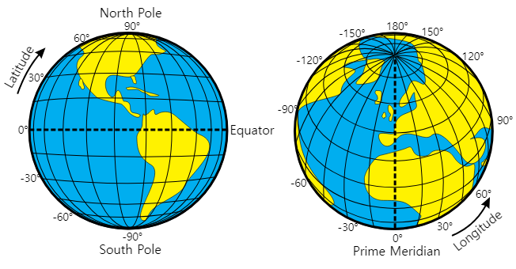
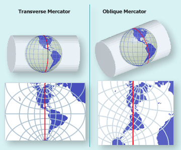
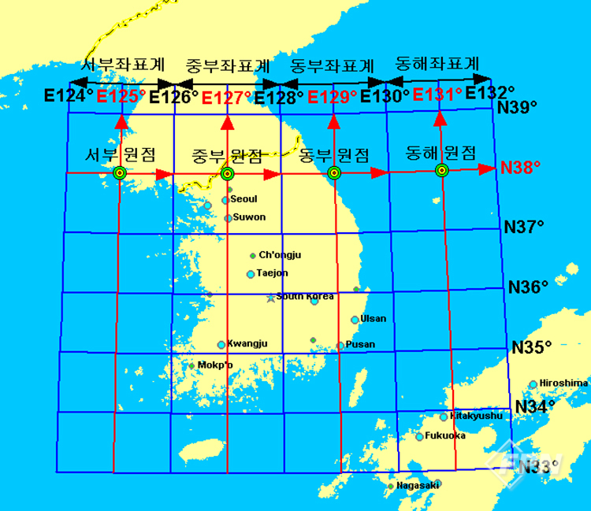

# 좌표계 및 투영법

GIS에서 좌표계와 투영법은 공간 데이터를 정확하게 표현하고 분석하는 데 매우 중요하다. <br/>
특히 한국을 중심으로 하는 경우, 한국에 맞는 좌표계와 투영법을 사용하는 것이 필수적이다.

## 좌표계에 대해
좌표계는 지구 상에 목표한 곳이 어디있는지 수치적으로 표현하기 위한 방법이다.<br/>
이 좌표계는 크게 지리 좌표계와 투영 좌표계로 나눌 수 있다.

두 좌표계는 서로 어떤 차이가 있는지 알아보자.
<br/> <br/> 

### 지리좌표계 (Geographic Coordinate System, GCS)


타원체인 지구를 우리가 흔히 사용하는 위도와 경도를 사용해 위치를 나타내는 방식이다.<br/>
한국은 약 126도 ~ 130도의 동경과 북위 33도에서 38도에 걸쳐 있다.

이 지리좌표계를 정의할 때, 지구의 형태를 결정하는 방식은 매우 중요하다.<br/>
지구는 완전한 구형이 아닌 타원체에 가까운데, 지리 좌표계에서 타원체를 바탕으로 위치를 계산하는 방식이 국제표준타원체인 WGS84와 GRS80이다.

```
WGS84 : 세계에서 가장 많이 사용되는 지리 좌표계로, GPS(Global Positioning System)의 표준 좌표계다.<br/> WGS84는 타원체와 동일한 이름을 가진 모델로, 글로벌한 위치 정보를 다룰 때 주로 사용된다.

GRS80: 한국에서 많이 사용하는 타원체로, 국가 기준 좌표계를 정의하는 데 사용된다. 한국의 Korea 2000 좌표계가 이를 기반으로 한다.
```

타원체보다 더 복잡한 지구의 실제 형태를 반영하기위한 모형으로, 지오이드(Geoid)가 있다.<br/>
해수면 굴곡을 반영해 타원체보다 더 정확한 고도 계산을 가능하게 한다.<br/>
그러나 보통의 경위도 표현에는 타원체가 더 일반적이니, 고도 계산을 활용할 때 지오이드를 활용한다고 생각하자. (지오이드고 및 타원체고 관련 내용은 이후에 다룸)<br/>

<br/>

### 투영 좌표계 (Projected Coordinate System, PCS)


투영 좌표계는 지구의 곡면을 평면에 투영하여 표현하는 좌표계이다.<br/> 
평면 지도에서 위치를 표현할 때 주로 사용되며, X(가로축)와 Y(세로축) 좌표로 표현된다.<br/>
지리 좌표계에서의 곡면 좌표를 투영 좌표계로 변환하는 과정에서 왜곡이 발생할 수 있다. <br/>
쉽게 생각해 공의 표면을 사각형 틀에 억지로 끼워맞춘다고 생각하면 된다.<br/> 
자연스레 늘어나는 지역과 오차가 발생하는 지역이 생긴다.<br/> 
투영 좌표계는 특정 지역에 맞게 이러한 왜곡을 최소화하도록 설계된 다양한 투영법을 사용한다.<br/> 

### 투영 좌표계의 종류<br/>
UTM(Universal Transverse Mercator): 지구를 6도 간격의 구역(zone)으로 나누어 각 구역을 따로 투영하는 방식이다. 한국은 UTM Zone 51N과 52N에 걸쳐 있으며, 각 구역마다 독립된 좌표계를 사용하여 왜곡을 최소화한다.<br/>

TM(Transverse Mercator): 한국에서 주로 사용되는 투영 좌표계로, 경도 127도를 기준으로 중부 원점 TM 좌표계가 사용된다. 이는 한국의 중심부에서의 정확한 공간 분석을 위해 설계된 방식<br/>
<br/><br/>

## 평면직각좌표게


우리나라는 국토를 네 구역으로 나누어 투영한다. <br/>
 N38°/E125°, N38°/E127°, N38°/E129°, N38°/E131°를 서부와 중부, 동부, 동해 원점으로 서쪽에서부터 서부 좌표계, 중부 좌표계, 동부 좌표계, 동해 좌표계라고 하며 ‘TM 좌표계’라고 부른다.

일반적으로 우리가 사용하는 2차원 좌표는 x축이 가로축, y축이 세로축이나, 직각 좌표계에서는 방향이 반대가 된다. x축이 북향 좌표를 나타내고, y축이 동향 좌표를 나타낸다.

이러한 혼란을 방지하기 위해 표기시 가급적 ```[원점 300,000mE 300,000mN]```와 같이 방향을 표기하도록한다.


## EPSG 코드

EPSG 코드는 특정 좌표계를 정의하고, 이를 간단한 숫자로 표현하여 쉽게 식별할 수 있도록 만들어진 시스템이다.<br/>
EPSG 코드 하나가 특정한 지리 좌표계(Geographic Coordinate System, GCS) 또는 투영 좌표계(Projected Coordinate System, PCS)를 나타낸다.<br/>
이를 통해 GIS 시스템에서 데이터를 일관되게 사용할 수 있으며, 서로 다른 좌표계를 쉽게 변환할 수 있다 <br/>

### 한국에서 사용되는 EPSG 코드


***EPSG:4326 – WGS84*** <br/>
EPSG:4326은 WGS84 좌표계를 나타내며, GPS와 전 세계 지리 정보 시스템에서 가장 널리 사용되는 좌표계이다. WGS84는 지리 좌표계로, 경도와 위도 값을 사용하여 위치를 표현한다.

***EPSG:5185 ~ 5188 – GRS80*** <br/>
GRS80은 지구의 타원체를 정의하는 기준이며 평균 해수면과 과도 차이를 기준으로 모델링한 것이다.

